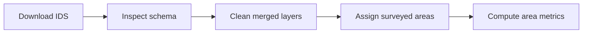

# IDS - Insect and Disease Survey

**Navigation:** [Repo Home](../README.md) | [Docs Hub](../docs/README.md) | [Setup](../scripts/SETUP.md) | [Reproduce](../docs/REPRODUCE.md) | [Pipeline Map](../docs/PIPELINE_MAP.md) | [Data Products](../docs/DATA_PRODUCTS.md) | [Technical Workflow](WORKFLOW.md) | [Scripts](scripts/)

## What this workstream does

`01_ids/` downloads, inspects, cleans, and organizes USDA Forest Service Insect and Disease Survey data into analysis-ready layers and lookup tables. It is the foundation for all IDS + climate work in this repository.

## When to use it

Use this workstream if you need:

- cleaned IDS damage area, damage point, and surveyed area layers
- lookup tables for IDS codes
- exploration CSVs for schema and coverage review
- the prerequisite inputs for TerraClimate, PRISM, or WorldClim extraction

## Quick facts

| Item | Value |
|---|---|
| Source | USDA Forest Service, Forest Health Protection |
| Spatial coverage | CONUS, Alaska, Hawaii |
| Temporal coverage | 1997-2024 |
| Raw format | 10 regional geodatabases plus zipped archives |
| Canonical cleaned output | `ids_layers_cleaned.gpkg` |

## Workflow At a Glance



## Production Scripts

| Step | Script | Role |
|---|---|---|
| 1 | [01_download_ids.R](scripts/01_download_ids.R) | Download the 10 regional geodatabases and expand the `.gdb` directories |
| 2 | [02_inspect_ids.R](scripts/02_inspect_ids.R) | Inspect schema and generate lookup tables |
| 3 | [03_clean_ids.R](scripts/03_clean_ids.R) | Merge and clean all IDS layers |
| 4 | [04_assign_surveyed_areas.R](scripts/04_assign_surveyed_areas.R) | Match damage areas to surveyed areas |
| 5 | [05_compute_area_metrics.R](scripts/05_compute_area_metrics.R) | Compute area metrics and damage fractions |

Optional QC:

- [validate_ids.R](scripts/qc/validate_ids.R)
- [explore_ids_coverage.R](scripts/qc/explore_ids_coverage.R)
- [IDS QC README](scripts/qc/README.md)

## Quick Start

Run scripts in order from the repo root:

```bash
Rscript 01_ids/scripts/01_download_ids.R
Rscript 01_ids/scripts/02_inspect_ids.R
Rscript 01_ids/scripts/03_clean_ids.R
Rscript 01_ids/scripts/04_assign_surveyed_areas.R
Rscript 01_ids/scripts/05_compute_area_metrics.R
```

## Key Outputs

| Output | Location | Notes |
|---|---|---|
| Regional raw archives | `01_ids/data/raw/*_AllYears.gdb.zip` | Downloaded by step 1 |
| Extracted regional geodatabases | `01_ids/data/raw/*_AllYears.gdb/` | Expanded `.gdb` directories used by later IDS steps |
| Cleaned IDS layers | `01_ids/data/processed/ids_layers_cleaned.gpkg` | Three layers: `damage_areas`, `damage_points`, `surveyed_areas` |
| Exploration CSVs | `01_ids/data/processed/ids_exploration_raw/*.csv` | Coverage, schema, and missingness summaries |
| Damage area to surveyed area matches | `processed/ids/damage_area_to_surveyed_area.parquet` | Output of step 4 |
| Damage area metrics | `processed/ids/damage_area_area_metrics.parquet` | Output of step 5 |
| Lookup tables | `01_ids/lookups/` | Generated by step 2 and tracked in git |

## Directory Layout

| Path | What belongs here |
|---|---|
| `01_ids/data/raw/` | Regional `.gdb.zip` downloads, extracted `.gdb/` directories, and the source IDS PDF readme |
| `01_ids/data/processed/` | `ids_layers_cleaned.gpkg` and `ids_exploration_raw/*.csv` |
| `01_ids/lookups/` | Git-tracked lookup tables built during inspection |
| `01_ids/docs/` | Repo copies of supporting source documentation and layer notes |
| `processed/ids/` | Cross-step derived outputs used by later climate and demo workflows |

Note: the provided server snapshot also includes `01_ids/data/processed/ids_damage_areas_cleaned.gpkg` as a convenience export. The current production scripts write the canonical multi-layer file `ids_layers_cleaned.gpkg`.

## Related Docs

| If you want... | Go to... |
|---|---|
| exact per-script behavior | [WORKFLOW.md](WORKFLOW.md) |
| reproduction order across the repo | [docs/REPRODUCE.md](../docs/REPRODUCE.md) |
| QC coverage | [docs/TESTING.md](../docs/TESTING.md) |
| output inventory | [docs/DATA_PRODUCTS.md](../docs/DATA_PRODUCTS.md) |

## See also

- [Repo Home](../README.md)
- [Docs Hub](../docs/README.md)
- [Technical Workflow](WORKFLOW.md)
- [TerraClimate README](../02_terraclimate/README.md)
