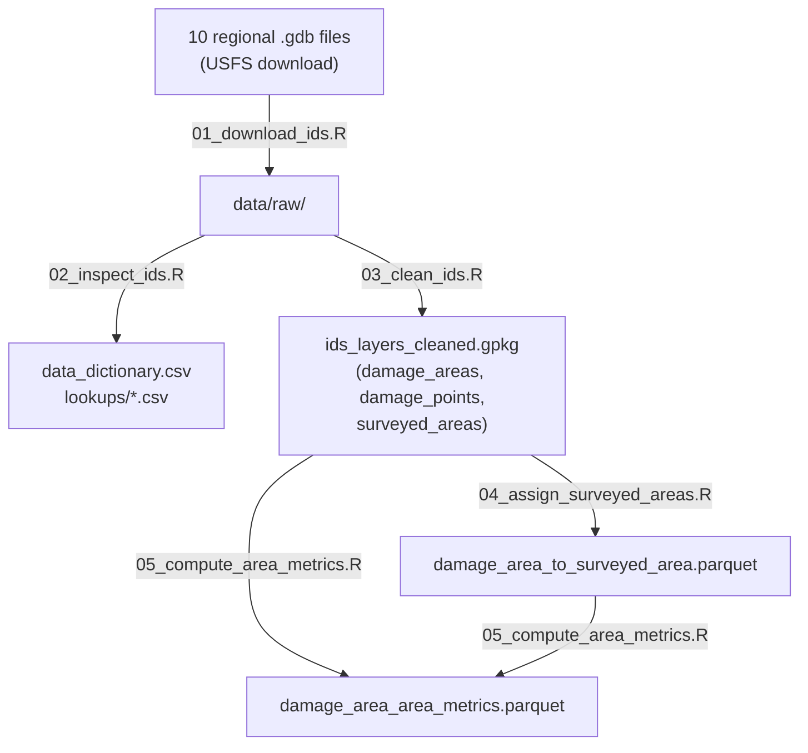

# IDS Data Workflow

For a quick-start guide and directory overview, see **README.md**.
This document covers technical architecture, per-script details, and usage examples.

---

## Pipeline Overview

Scripts are split into two groups:

**Production pipeline** - run in order to produce the cleaned data:
- [x] `01_download_ids.R` - download raw geodatabases
- [x] `02_inspect_ids.R` - inspect structure, generate lookup tables
- [x] `03_clean_ids.R` - merge and clean all regions
- [ ] `04_assign_surveyed_areas.R` - spatial join: damage areas → surveyed areas
- [ ] `05_compute_area_metrics.R` - compute damage area size and survey fraction

**QC / diagnostics** (`scripts/qc/`) - one-time analysis, not required to reproduce data:
- [x] `qc/validate_ids.R` - validate cleaned output (console checks only)
- [x] `qc/explore_ids_coverage.R` - explore raw data coverage, era differences

---

## Production Pipeline

### 01_download_ids.R
Downloads all regional geodatabases from USFS.
- **Input:** URLs from config.yaml
- **Output:** 10 raw .gdb files in `data/raw/` (~1.6 GB total)
- Skips files that already exist

### 02_inspect_ids.R
Explores raw data structure, checks field consistency across regions, and generates lookup tables.
- **Input:** Raw .gdb files in `data/raw/`
- **Output:**
  - `data_dictionary.csv` (field metadata from R5 sample)
  - `lookups/host_code_lookup.csv` (76 species)
  - `lookups/dca_code_lookup.csv` (130 damage agents)
  - `lookups/damage_type_lookup.csv` (9 types)
  - `lookups/percent_affected_lookup.csv` (5 levels)
  - `lookups/legacy_severity_lookup.csv` (4 levels)
  - `lookups/region_lookup.csv` (10 regions)
- **Key findings:** All 10 regions have identical field structure (44 fields); three different CRS across regions; legacy vs DMSM methodology break ~2015

### 03_clean_ids.R
Selects fields, transforms CRS, and merges all regions for every IDS layer.
- **Input:** 10 raw .gdb files in `data/raw/`
- **Output:** `data/processed/ids_layers_cleaned.gpkg` (layers: `damage_areas`, `damage_points`, `surveyed_areas`)
- **Actions:**
  - Select layer-specific fields (damage layers keep 15 fields; surveyed areas keep 4 fields). Codes only - use lookups for names.
  - Transform all regions to EPSG:4326 (WGS84)
  - Standardize OBSERVATION_COUNT to uppercase (damage layers)
  - Recode PERCENT_AFFECTED_CODE -1 → NA (damage layers)
  - Add SOURCE_FILE column for traceability
  - Generate SURVEY_FEATURE_ID for surveyed_areas
  - Merge all 10 regions per layer into a single geopackage

### 04_assign_surveyed_areas.R
Spatially assigns each DAMAGE_AREA_ID to the best-matching SURVEYED_AREA_ID via polygon intersection with max-overlap selection. Processed in chunks (10k features) to handle millions of geometries.
- **Input:** `data/processed/ids_layers_cleaned.gpkg` (damage_areas + surveyed_areas layers)
- **Output:** `processed/ids/damage_area_to_surveyed_area.parquet`
  - Columns: DAMAGE_AREA_ID, SURVEYED_AREA_ID, overlap_m2, match_quality_flag
  - match_quality_flag: "matched" or "no_survey"
- **CRS:** Transforms to EPSG:5070 (Conus Albers) for accurate area intersection
- **Notes:**
  - Filters surveyed areas to matching SURVEY_YEAR for efficiency
  - Unmatched damage areas are flagged, not dropped

### 05_compute_area_metrics.R
Computes area metrics for damage areas and their assigned surveyed areas.
- **Input:**
  - `data/processed/ids_layers_cleaned.gpkg`
  - `processed/ids/damage_area_to_surveyed_area.parquet` (from step 04)
- **Output:** `processed/ids/damage_area_area_metrics.parquet`
  - Columns: DAMAGE_AREA_ID, damage_area_m2, SURVEYED_AREA_ID, survey_area_m2, damage_frac_of_survey
- **CRS:** EPSG:5070 for area calculations
- **Notes:**
  - damage_frac_of_survey = damage_area_m2 / survey_area_m2
  - NA where no surveyed area assigned or survey_area_m2 = 0
  - IDS SURVEY_YEAR is preserved as-is (NOT converted to water year)

---

## QC / Diagnostics

These scripts are diagnostic tools run once during development. They are not required to reproduce the cleaned data. Re-run if you need to audit data quality or update the exploration summaries.

### scripts/qc/validate_ids.R
Validates cleaned output. Prints field checks, geometry counts, and summary stats. No files written.
- **Input:** `data/processed/ids_layers_cleaned.gpkg`
- **Checks:** Field structure, CRS (EPSG:4326), cleaning actions (uppercase, no -1 values), geometry validity, region/year distributions

### scripts/qc/explore_ids_coverage.R
Analyzes raw data for era differences, missingness, and regional temporal coverage.
- **Input:** Raw .gdb files in `data/raw/`
- **Output:** `data/processed/ids_exploration_raw/`
  - `ids_columns_by_era.csv` - which columns have data pre/post 2015
  - `ids_missing_by_era.csv` - fraction NA per column per era
  - `ids_value_summary_pre_2015.csv` / `ids_value_summary_post_2015.csv`
  - `ids_region_coverage.csv` - year range and gaps per region
