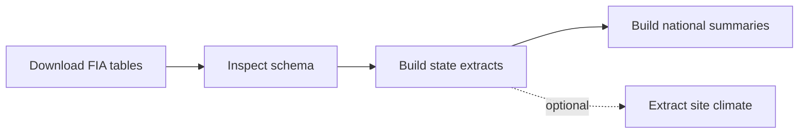

# FIA - Forest Inventory and Analysis

**Navigation:** [Repo Home](../README.md) | [Docs Hub](../docs/README.md) | [Setup](../scripts/SETUP.md) | [Reproduce](../docs/REPRODUCE.md) | [Pipeline Map](../docs/PIPELINE_MAP.md) | [Data Products](../docs/DATA_PRODUCTS.md) | [Technical Workflow](WORKFLOW.md) | [Scripts](scripts/)

## What this workstream does

`05_fia/` downloads FIA DataMart tables, builds state-level parquet extracts, and compiles national plot-level summaries for forest structure, seedlings, mortality, disturbance, treatment history, and exclusion flags. It also includes an optional TerraClimate site-climate extraction for FIA plot locations.

## When to use it

Use this workstream if you need:

- FIA plot-level forest structure and diversity metrics
- disturbance and treatment history by plot and inventory year
- species and forest-type lookup tables
- per-state parquet partitions for tree, condition, seedling, mortality, damage-agent, and harvest-flag data
- monthly TerraClimate at FIA site locations

## Quick facts

| Item | Value |
|---|---|
| Source | USDA Forest Service FIA DataMart |
| Coverage | All 50 US states |
| Inventory years | 2000-2024 |
| Site-climate years | 1958-2024 |
| Main format | CSV to parquet |
| Optional GEE step | Site climate only |

## Workflow At a Glance



## Production Scripts

| Step | Script | Role |
|---|---|---|
| 1 | [01_download_fia.R](scripts/01_download_fia.R) | Download FIA state CSVs and national REF tables |
| 2 | [02_inspect_fia.R](scripts/02_inspect_fia.R) | Inspect schema and create lookup parquets |
| 3 | [03_extract_trees.R](scripts/03_extract_trees.R) | Build per-state tree, condition, damage-agent, and harvest-flag tables |
| 4 | [04_extract_seedlings_mortality.R](scripts/04_extract_seedlings_mortality.R) | Build per-state seedling and mortality tables |
| 5 | [05_build_fia_summaries.R](scripts/05_build_fia_summaries.R) | Build national plot-level summary outputs |
| 6 | [06_extract_site_climate.R](scripts/06_extract_site_climate.R) | Optional TerraClimate extraction for FIA sites |

## Quick Start

Install `rFIA` before step 1 if it is not already present in your environment.

```bash
Rscript 05_fia/scripts/01_download_fia.R
Rscript 05_fia/scripts/02_inspect_fia.R
Rscript 05_fia/scripts/03_extract_trees.R
Rscript 05_fia/scripts/04_extract_seedlings_mortality.R
Rscript 05_fia/scripts/05_build_fia_summaries.R
Rscript 05_fia/scripts/06_extract_site_climate.R
```

Notes:

- Steps 1-5 are the core FIA pipeline.
- Step 6 is optional and requires Google Earth Engine.

## Key Outputs

| Output family | Location | Notes |
|---|---|---|
| Raw state CSV bundles | `05_fia/data/raw/{ST}/` | Contains `COND`, `PLOT`, `SEEDLING`, `TREE`, and `TREE_GRM_COMPONENT` CSVs by state |
| Raw REF tables | `05_fia/data/raw/REF/` | Contains `REF_SPECIES.csv` and `REF_FOREST_TYPE.csv` |
| FIA lookup parquets | `05_fia/lookups/` | Tracked in git |
| Per-state extracted tables | `05_fia/data/processed/{trees,cond,damage_agents,harvest_flags,seedlings,mortality}/state={ST}/` | Local parquet partitions |
| National plot summaries | `05_fia/data/processed/summaries/` | Tracked in git |
| Site climate input template | `05_fia/data/processed/site_climate/all_site_locations.csv` | Tracked in git and used as the input site list |
| Site climate checkpoints | `05_fia/data/processed/site_climate/_gee_annual/` | Local yearly checkpoint parquets used for resumable GEE extraction |
| Site climate outputs | `05_fia/data/processed/site_climate/site_pixel_map.parquet` and `site_climate.parquet` | Tracked in git |

The repo keeps the parent output folders in git, while the deeper `state={ST}/` partition directories are created by the extraction scripts when those local outputs are generated.

## Main Git-Tracked Output Files

- `05_fia/lookups/ref_species.parquet`
- `05_fia/lookups/ref_forest_type.parquet`
- `05_fia/data/processed/summaries/plot_tree_metrics.parquet`
- `05_fia/data/processed/summaries/plot_seedling_metrics.parquet`
- `05_fia/data/processed/summaries/plot_mortality_metrics.parquet`
- `05_fia/data/processed/summaries/plot_disturbance_history.parquet`
- `05_fia/data/processed/summaries/plot_damage_agents.parquet`
- `05_fia/data/processed/summaries/plot_treatment_history.parquet`
- `05_fia/data/processed/summaries/plot_cond_fortypcd.parquet`
- `05_fia/data/processed/summaries/plot_exclusion_flags.parquet`
- `05_fia/data/processed/site_climate/all_site_locations.csv`
- `05_fia/data/processed/site_climate/site_pixel_map.parquet`
- `05_fia/data/processed/site_climate/site_climate.parquet`

## Directory Layout

| Path | What belongs here |
|---|---|
| `05_fia/data/raw/{ST}/` | State-level FIA CSV downloads |
| `05_fia/data/raw/REF/` | National FIA reference tables |
| `05_fia/lookups/` | Git-tracked parquet versions of the reference tables |
| `05_fia/data/processed/trees/state={ST}/` | Per-state tree extracts |
| `05_fia/data/processed/cond/state={ST}/` | Per-state condition extracts |
| `05_fia/data/processed/damage_agents/state={ST}/` | Per-state damage-agent extracts |
| `05_fia/data/processed/harvest_flags/state={ST}/` | Per-state harvest-flag extracts |
| `05_fia/data/processed/seedlings/state={ST}/` | Per-state seedling extracts |
| `05_fia/data/processed/mortality/state={ST}/` | Per-state mortality extracts |
| `05_fia/data/processed/summaries/` | National plot-level summary parquets |
| `05_fia/data/processed/site_climate/` | Site list input, yearly GEE checkpoints, site pixel map, and final climate parquet |

## Related Docs

| If you want... | Go to... |
|---|---|
| per-script technical detail and field definitions | [WORKFLOW.md](WORKFLOW.md) |
| exact reproduction order | [docs/REPRODUCE.md](../docs/REPRODUCE.md) |
| output inventory | [docs/DATA_PRODUCTS.md](../docs/DATA_PRODUCTS.md) |
| shared climate architecture for the optional site-climate step | [docs/ARCHITECTURE.md](../docs/ARCHITECTURE.md) |

## See also

- [Docs Hub](../docs/README.md)
- [Technical Workflow](WORKFLOW.md)
- [Data Products](../docs/DATA_PRODUCTS.md)
- [Pipeline Map](../docs/PIPELINE_MAP.md)
