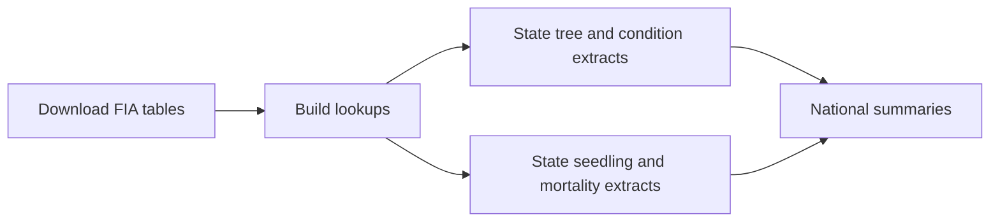

# FIA - Forest Inventory and Analysis

**Navigation:** [Repo Home](../README.md) | [Docs Hub](../docs/README.md) | [Technical Workflow](WORKFLOW.md) | [FIA Visual Explainer](../docs/fia-explorer.html) | [Reproduce](../docs/REPRODUCE.md) | [Data Products](../docs/DATA_PRODUCTS.md)

## What This Workstream Does

`05_fia/` downloads USDA Forest Service FIA tables and turns them into
documented state extracts and national products for forest structure, species
composition, mortality, disturbance, treatment history, and analysis
eligibility.

For a visual introduction to FIA plots, conditions, subplots, and microplots,
start with the [FIA visual explainer](../docs/fia-explorer.html).

## Workflow At A Glance



## Production Scripts

| Step | Script | Main result |
|---|---|---|
| 1 | [01_download_fia.R](scripts/01_download_fia.R) | State FIA CSVs and national reference tables |
| 2 | [02_inspect_fia.R](scripts/02_inspect_fia.R) | Species and forest-type lookup parquets |
| 3 | [03_extract_trees.R](scripts/03_extract_trees.R) | State tree, condition, damage-agent, and harvest-flag partitions |
| 4 | [04_extract_seedlings_mortality.R](scripts/04_extract_seedlings_mortality.R) | State seedling and mortality partitions |
| 5 | [05_build_fia_summaries.R](scripts/05_build_fia_summaries.R) | National metric, species-composition, disturbance, and review products |

Detailed processing rules and dependencies are in
[WORKFLOW.md: Script Details](WORKFLOW.md#script-details).

## Quick Start

```bash
Rscript 05_fia/scripts/01_download_fia.R
Rscript 05_fia/scripts/02_inspect_fia.R
Rscript 05_fia/scripts/03_extract_trees.R
Rscript 05_fia/scripts/04_extract_seedlings_mortality.R
Rscript 05_fia/scripts/05_build_fia_summaries.R
```

Install `rFIA` before script `01`. See [Setup](../scripts/SETUP.md) and
[Reproduce](../docs/REPRODUCE.md) for environment and server instructions.

## Main Outputs

### State Partitions

| Product | What one row represents | Details |
|---|---|---|
| `trees/state={ST}/trees_{ST}.parquet` | Species and tree stratum within a plot visit, condition, and subplot | [Output dictionary](WORKFLOW.md#tree-state-partitions) |
| `cond/state={ST}/cond_{ST}.parquet` | One mapped condition within a plot visit | [Output dictionary](WORKFLOW.md#condition-state-partitions) |
| `damage_agents/state={ST}/damage_agents_{ST}.parquet` | Species and damage agent within a condition | [Output dictionary](WORKFLOW.md#damage-agent-state-partitions) |
| `harvest_flags/state={ST}/harvest_flags_{ST}.parquet` | Plot visit with an incidental harvest/removal code | [Output dictionary](WORKFLOW.md#harvest-flag-state-partitions) |
| `seedlings/state={ST}/seedlings_{ST}.parquet` | Seedling species on a subplot microplot and condition | [Output dictionary](WORKFLOW.md#seedling-state-partitions) |
| `mortality/state={ST}/mortality_{ST}.parquet` | Species, mortality/removal agent, and component within a plot visit | [Output dictionary](WORKFLOW.md#mortality-state-partitions) |

### National Products

| Product | Main use | Details |
|---|---|---|
| `plot_tree_metrics.parquet` | Plot-level structure and tree diversity | [Output dictionary](WORKFLOW.md#plot-tree-metrics) |
| `plot_seedling_metrics.parquet` | Plot-level seedling totals and diversity | [Output dictionary](WORKFLOW.md#plot-seedling-metrics) |
| `plot_mortality_metrics.parquet` | Mortality and harvest removals by species and agent | [Output dictionary](WORKFLOW.md#plot-mortality-metrics) |
| `plot_cond_fortypcd.parquet` | Compact condition, forest-type, and raw disturbance fields | [Output dictionary](WORKFLOW.md#plot-condition-forest-type) |
| `plot_condition_metadata.parquet` | Stable condition-level join backbone | [Output dictionary](WORKFLOW.md#plot-condition-metadata) |
| `plot_tree_species.parquet` | Live tree composition, stems at least 5 inches diameter | [Output dictionary](WORKFLOW.md#plot-tree-species) |
| `plot_sapling_species.parquet` | Live sapling composition, stems 1.0-4.9 inches diameter | [Output dictionary](WORKFLOW.md#plot-sapling-species) |
| `plot_seedling_species.parquet` | Tree regeneration composition below 1 inch diameter | [Output dictionary](WORKFLOW.md#plot-seedling-species) |
| `plot_disturbance_classification.parquet` | Natural-disturbance and control eligibility | [Output dictionary](WORKFLOW.md#plot-disturbance-classification) |
| `plot_disturbance_history.parquet` | Long-form recorded disturbance events | [Output dictionary](WORKFLOW.md#plot-disturbance-history) |
| `plot_treatment_history.parquet` | Long-form silvicultural treatments | [Output dictionary](WORKFLOW.md#plot-treatment-history) |
| `plot_damage_agents.parquet` | Labeled live-tree damage-agent summaries | [Output dictionary](WORKFLOW.md#plot-damage-agents) |
| `plot_exclusion_flags.parquet` | Whole-plot review and sensitivity flags | [Output dictionary](WORKFLOW.md#plot-exclusion-flags) |

## Optional Site-Climate Extension

The core FIA pipeline ends at script `05`. A separate optional workflow builds
monthly TerraClimate values at FIA plot coordinates for dashboard exploration
and legacy FIA-location climate analyses:

```bash
Rscript 05_fia/scripts/site_climate/01_build_site_list.R
Rscript 05_fia/scripts/site_climate/02_extract_terraclimate.R
```

This extension is not an input to the current BIEN-range species-niche method.
See [WORKFLOW.md: Optional Site-Climate Extension](WORKFLOW.md#optional-site-climate-extension).

## Where To Look

| Question | Documentation |
|---|---|
| What does each script do? | [Technical Workflow](WORKFLOW.md#script-details) |
| What does one row represent, and what do the columns mean? | [Output Data Dictionary](WORKFLOW.md#output-data-dictionary) |
| How are conditions, subplots, seedlings, saplings, and trees related? | [FIA Visual Explainer](../docs/fia-explorer.html) |
| Which script creates each national product? | [Detailed Output Provenance](WORKFLOW.md#detailed-output-provenance) |
| How do I reproduce the pipeline? | [Reproduce](../docs/REPRODUCE.md) |
| How are FIA species used to build climate niches? | [Species Niches](../06_species_niches/README.md) |

## Directory Layout

| Path | Contents |
|---|---|
| `data/raw/{ST}/` | State FIA CSV downloads |
| `lookups/` | Species and forest-type reference parquets |
| `data/processed/*/state={ST}/` | State-partitioned FIA extracts |
| `data/processed/summaries/` | National metric and analysis-ready products |
| `scripts/summaries/` | Focused builders called by script `05` |
| `scripts/qc/` | FIA product validation scripts |
| `scripts/site_climate/` | Optional FIA-site TerraClimate extension |
| `tests/` | Automated output checks |
