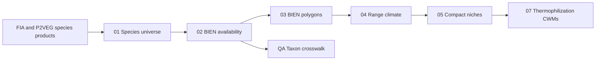

# Species Climate Niches - Technical Workflow

**Navigation:** [Repo Home](../README.md) | [Docs Hub](../docs/README.md) | [Module README](README.md) | [Methods](docs/methods_species_niches.md) | [QA Guide](qa/README.md) | [Data Products](../docs/DATA_PRODUCTS.md) | [Thermophilization](../07_thermophilization/README.md)

This document explains the species-niche scripts, their dependencies, and the contents of each generated table. Use [README.md](README.md) for the short run order and navigation.

## Workflow At A Glance



The module assigns one climate niche to each resolved taxon. Seedling, sapling, tree, shrub, forb, and graminoid communities use the same taxon-level niche values; their observed abundances remain separate in the community products.

The production products keep source-specific keys (`fia_spcd:*` and `p2veg:*`) so joins back to FIA and P2VEG remain unambiguous. The taxon crosswalk created by QA script `09` is the place to answer species-level questions after deduplicating multiple source codes that refer to the same biological taxon.

## Data Sources

| Source | Role |
|---|---|
| FIA and P2VEG products | Define which taxa occur in the project data and where they occur in community layers |
| BIEN range maps | Supply mapped species ranges |
| TerraClimate | Supplies the 1981-2010 monthly climate baseline over those ranges |
| TNRS and reviewed references | Support manual review of names that BIEN does not match directly |

(BIEN ranges, not FIA coordinates, are the primary climate-niche source. The optional FIA site-climate extension under `05_fia/scripts/site_climate/` is a different product and is not an input to this workflow.)

## Script Details

### 01 Build Species Universe

Script: [01_build_species_universe.R](scripts/01_build_species_universe.R)

**Purpose:** Combine the distinct source species codes observed in FIA tree, sapling, and seedling products and P2VEG understory products.

**Main inputs:**

- `05_fia/data/processed/summaries/plot_tree_species.parquet`
- `05_fia/data/processed/summaries/plot_sapling_species.parquet`
- `05_fia/data/processed/summaries/plot_seedling_species.parquet`
- P2VEG species products when present

**Main output:** `data/processed/species_universe.parquet`

The output is a taxon inventory, not an occurrence table. Counts and abundance fields summarize how strongly each source code is represented and help prioritize missing-niche review.

Genus-only, aggregate, and unknown records remain in the universe for coverage accounting, but `needs_niche = FALSE` prevents them from being sent to BIEN as species-level targets.

**Supporting QA:**

- `qa/outputs/species_universe_metrics.csv`
- `qa/outputs/species_universe_layer_counts.csv`
- `qa/outputs/species_universe_pseudo_taxa.csv`

### 02 Check BIEN Ranges

Script: [02_check_bien_ranges.R](scripts/02_check_bien_ranges.R)

**Purpose:** Query BIEN for every target taxon and record whether a range map is available.

**Main inputs:**

- `data/processed/species_universe.parquet`
- `lookups/manual_bien_name_overrides_reviewed.csv`

**Main output:** `data/processed/bien_range_availability.parquet`

Reviewed overrides may change the name submitted to BIEN, but they do not replace the original source identity or `species_key`. Only override rows with `review_status = ready_for_pipeline` are applied.

**Supporting QA:**

- `qa/outputs/bien_range_availability_summary.csv`
- `qa/outputs/bien_range_availability_by_layer.csv`
- `qa/outputs/bien_range_missing_species.csv`
- `qa/outputs/manual_bien_overrides_applied.csv`

### 03 Download BIEN Ranges

Script: [03_download_bien_ranges.R](scripts/03_download_bien_ranges.R)

**Purpose:** Download BIEN ranges, cache each successful species download, and combine the ranges into one analysis-ready spatial file.

**Main input:** `data/processed/bien_range_availability.parquet`

**Cached inputs:** `data/raw/bien_ranges/*.gpkg`

**Main output:** `data/processed/species_range_polygons.gpkg`

Existing per-species caches are reused unless `--force` is supplied. Geometry validity, geodesic area, global equal-area comparison, bounding boxes, and broad extent flags are calculated before the consolidated file is written.

**Supporting QA:**

- `qa/outputs/bien_range_polygon_summary.csv`
- `qa/outputs/bien_range_polygon_failures.csv`

### 04 Extract TerraClimate From Ranges

Script: [04_extract_terraclimate_from_ranges.R](scripts/04_extract_terraclimate_from_ranges.R)

**Purpose:** Overlay BIEN range polygons with a monthly TerraClimate climatology through Google Earth Engine.

**Main inputs:**

- `data/processed/species_range_polygons.gpkg`
- `data/processed/bien_range_availability.parquet`
- Google Earth Engine configuration

**Main outputs:**

- `data/processed/species_range_climate.parquet` for full BIEN ranges
- `data/processed/species_range_climate_us_study_area.parquet` for ranges clipped to the configured study-area bounding box

The default climatology is 1981-2010. Monthly `tmmx` and `tmmn` are converted to mean temperature (`tmean`). Spatial `mean`, `p10`, `p50`, and `p90` summaries are retained unless `--mean-only` is used.

The study-area scope uses the bounding box in `config.yaml`, including Alaska and Hawaii. It is not a political-boundary clip.

Batch outputs are cached under `data/processed/_range_climate_batches/`. The cache key records the species set and extraction settings so incompatible batches are not silently reused.

For a small refresh after adding polygons or resolving an extraction failure, pass a one-column species-key file:

```bash
Rscript 06_species_niches/scripts/04_extract_terraclimate_from_ranges.R --range-scope=global --species-keys-file=06_species_niches/lookups/range_climate_target_species.csv
```

A targeted production run replaces only the requested species inside the existing full range-climate parquet. It preserves all unaffected species. Run the targeted command for each required range scope, then rerun script `05`.

**Supporting QA:**

- `qa/outputs/species_range_climate_summary*.csv`
- `qa/outputs/species_range_climate_failures*.csv`

### 05 Build Species Climate Niches

Script: [05_build_species_climate_niches.R](scripts/05_build_species_climate_niches.R)

**Purpose:** Convert monthly range-climate summaries into eight compact, interpretable species traits.

**Main inputs:**

- `data/processed/species_range_climate.parquet`
- or `data/processed/species_range_climate_us_study_area.parquet`

**Main outputs:**

- `data/processed/species_climate_niches.parquet`
- `data/processed/species_climate_niches_us_study_area.parquet`

The compact indicators and formulas are documented in [Methods: Compact Niche Indicators](docs/methods_species_niches.md#compact-niche-indicators).

**Supporting QA:**

- `qa/outputs/species_climate_niches_summary*.csv`
- `qa/outputs/species_climate_niches_rankings*.csv`
- `qa/outputs/species_climate_niches_missing*.csv`

## Output Data Dictionary

The parquet or GeoPackage schema is the exact machine-readable authority. The descriptions below explain what one row means and how the fields are used.

### species_universe.parquet

**Grain:** One row per source code, such as one FIA `SPCD` or one P2VEG plant
code.

**Plain-language description:** The master inventory of taxa observed in the project's FIA and P2VEG community products. It records names, source codes, community layers, geographic representation, summarized abundance, and whether the record is specific enough for a species-level niche.

| Column group | Columns | Meaning |
|---|---|---|
| Project identity | `species_key`, `source_code_system`, `source_species_code` | Stable source-specific key used to join the niche back to FIA or P2VEG |
| Names | `scientific_name`, `common_name`, `genus`, `specific_epithet` | Human-readable source taxonomy |
| Provenance | `source_tables`, `community_layers`, `growth_habits` | Products and biological layers where the code occurs |
| Coverage | `states_present`, `n_states`, `n_plot_visits`, `n_conditions`, `n_source_rows` | How broadly the source code appears |
| Abundance | `abundance_total` | Summarized source abundance used for prioritization, not a universal cross-layer abundance measure |
| Layer flags | `in_seedlings`, `in_saplings`, `in_trees`, `in_shrubs`, `in_forbs`, `in_graminoids`, `in_p2veg_tree_layers` | Whether the taxon occurs in each community layer |
| Niche eligibility | `is_pseudo_taxon`, `has_scientific_name`, `needs_niche` | Whether a defensible species-level BIEN query can be attempted |

### species_niche_taxon_crosswalk.parquet

**Grain:** One row per source `species_key`, with taxon-resolution fields added.

**Plain-language description:** A bridge between source-specific community codes and biological taxa. It preserves the original FIA/P2VEG key used for joins, but adds taxon keys used for reporting how many unique taxa are covered, missing, duplicated across source systems, or potentially recoverable through TNRS candidate names.

This product is generated by QA script [`09_build_species_taxon_crosswalk.R`](qa/09_build_species_taxon_crosswalk.R). It does not modify the production community tables or the CWM builder.

| Column group | Important columns | Meaning |
|---|---|---|
| Source identity | `species_key`, `source_code_system`, `source_species_code`, `scientific_name`, `common_name` | Original FIA or P2VEG code and name; use this for joins |
| Source taxon | `source_taxon_name`, `source_taxon_key`, `n_source_codes_for_source_taxon` | Raw scientific-name taxon used to identify duplicate source codes |
| Current resolved taxon | `resolved_taxon_name`, `resolved_taxon_key` | Taxon currently used by the BIEN availability workflow after reviewed overrides |
| Reporting taxon | `taxon_count_name`, `taxon_count_key`, `taxon_resolution_status` | Taxon and status used for species-level counts |
| TNRS candidate | `candidate_taxon_name`, `candidate_taxon_key`, `candidate_bien_range_available`, `tnrs_review_class` | Unreviewed rescue candidate from TNRS/BIEN diagnostics |
| Current products | `bien_range_available`, `has_study_area_niche_current`, `has_global_niche_current` | Whether current source-key products have range/niche coverage |
| Range review | `range_quality_review`, `range_area_global_equal_km2_qa` | Flags tiny, broad, or global-fallback ranges that need review |
| Source importance | `source_tables`, `community_layers`, counts, `abundance_total`, `cwm_missing_weight` | Helps prioritize missing taxa |

Use this file when the question is "how many biological taxa are missing?" Use `species_universe.parquet` when the question is "which source codes occur in the project data?"

### bien_range_availability.parquet

**Grain:** One row per species-universe record where `needs_niche = TRUE`.

**Plain-language description:** The BIEN lookup audit. It preserves the source identity, records the exact name submitted to BIEN, reports whether BIEN has a range, and carries reviewed override information and source-abundance context.

| Column group | Important columns | Meaning |
|---|---|---|
| Source identity | `species_key`, `source_code_system`, `source_species_code`, source names | Original FIA or P2VEG identity retained for joins |
| BIEN query | `original_bien_query_name`, `bien_query_scientific_name`, `bien_query_name` | Original and final submitted names |
| Resolved taxon | `niche_taxon_name`, `niche_taxon_key` | Conceptual BIEN taxon supplying the niche |
| Override audit | `uses_manual_bien_override`, `manual_bien_override_name`, `override_decision`, `override_confidence`, `override_review_status`, `override_notes` | Whether and why a reviewed name replacement was used |
| Availability | `bien_range_available`, `range_lookup_status`, `range_match_status` | BIEN range result |
| Review fields | `needs_range_review`, `range_review_reason`, `range_lookup_error` | Why a target needs follow-up |
| Source importance | Layer flags, source tables, state/visit/condition counts, `abundance_total` | Context used to prioritize missing ranges |

### species_range_polygons.gpkg

**Grain:** One consolidated polygon feature per BIEN-available source `species_key`.

**Plain-language description:** The locally stored BIEN range map attached to the project's source-species identity, plus geometry checks used before climate extraction.

| Column group | Important columns | Meaning |
|---|---|---|
| BIEN identity | `species`, `gid`, `bien_query_name`, `niche_taxon_name`, `niche_taxon_key` | Names and identifiers associated with the downloaded map |
| Project identity | `species_key` | Join back to the source species record |
| Download audit | `download_status`, `download_error` | Whether the range was downloaded cleanly |
| Geometry checks | `geometry_is_empty`, `geometry_is_valid` | Basic validity checks |
| Area checks | `range_area_geodesic_km2_qa`, `range_area_global_equal_km2_qa`, `range_area_km2_qa` | Geodesic area and global equal-area comparison |
| Extent checks | `range_xmin`, `range_ymin`, `range_xmax`, `range_ymax`, `range_longitude_span`, `range_latitude_span`, `range_extent_review` | Bounding-box diagnostics for unusually broad ranges |
| Geometry | `geom` | WGS84 BIEN range polygon |

### species_range_climate.parquet

This description also applies to `species_range_climate_us_study_area.parquet`, which adds `range_scope`.

**Grain:** One row per `species_key x month x variable x metric`.

**Plain-language description:** Monthly climate summaries across the mapped range. A species therefore has multiple rows: one for each month, climate variable, and spatial summary statistic.

| Column group | Columns | Meaning |
|---|---|---|
| Identity | `species_key`, `source_code_system`, `source_species_code`, `scientific_name`, `common_name`, `community_layers`, `bien_query_name` | Source and BIEN lookup context |
| Climate dimension | `month`, `variable`, `metric`, `value` | Calendar month, climate variable, spatial statistic, and resulting value |
| Method | `climate_period`, `climate_source`, `range_source`, `range_scope` when present | Baseline period, TerraClimate, BIEN, and extraction scope |

Current variables include `tmmx`, `tmmn`, derived `tmean`, `pr`, `def`, `pet`, and `aet`; the compact niche builder uses `tmean`, `pr`, and `def`.

### species_climate_niches.parquet

This description also applies to `species_climate_niches_us_study_area.parquet`, which includes `range_scope`.

**Grain:** One row per source `species_key`.

**Plain-language description:** The compact species trait table joined to FIA communities. It describes the realized climate associated with the species' mapped BIEN range during the baseline period. It does not vary by FIA plot, inventory year, or life stage.

| Column group | Columns | Meaning |
|---|---|---|
| Identity | `species_key`, `source_code_system`, `source_species_code`, `scientific_name`, `common_name`, `community_layers`, `bien_query_name` | Join and review fields |
| Temperature | `tmean_annual_mean`, `tmean_warmest_month_mean`, `tmean_coldest_month_mean`, `temp_seasonality_mean` | Thermal niche center, seasonal extremes, and annual range |
| Water deficit | `cwd_annual_sum`, `cwd_max_month_mean` | Annual and peak dry-climate affinity |
| Precipitation | `pr_annual_sum`, `pr_driest_month_mean` | Annual moisture supply and driest-month precipitation |
| Completeness | `n_indicators_present`, `n_months_tmean`, `n_months_cwd`, `n_months_pr` | Whether all indicators use twelve valid months |
| Method | `climate_period`, `climate_source`, `range_source`, `range_scope` when present, `niche_method` | Reproducibility metadata |

## Validation And Gap Products

QA outputs are diagnostics, not analysis inputs. Start with the small set below instead of opening every file under `qa/outputs/`.

| Output | Grain | Plain-language purpose |
|---|---|---|
| `species_niche_validation_decision.csv` | One row per workflow decision | Says whether scripts 01-03 can proceed to climate extraction and whether unresolved warnings remain before modeling |
| `species_niche_validation_checks.csv` | One row per check | Full structural, freshness, geometry, coverage, and downstream handoff checklist |
| `species_niche_validation_summary.csv` | One row per headline metric | Current universe, target, BIEN availability, and polygon counts |
| `species_niche_gap_summary.csv` | One row per gap stage | Counts taxa with usable niches and categorizes why others are missing |
| `species_niche_gap_action_summary.csv` | One row per priority/action group | Summarizes which missing taxa should be excluded, reviewed, or sourced elsewhere |
| `study_area_climate_gap_summary.csv` | One row per diagnosed gap type | Distinguishes ranges outside the study-area box from extraction problems |

For the full diagnostic index and interpretation rules, see [qa/README.md](qa/README.md).

## Run Order

Production run:

```bash
Rscript 06_species_niches/scripts/01_build_species_universe.R
Rscript 06_species_niches/scripts/02_check_bien_ranges.R
Rscript 06_species_niches/scripts/03_download_bien_ranges.R
Rscript 06_species_niches/qa/01_validate_species_niche_workflow.R
Rscript 06_species_niches/scripts/04_extract_terraclimate_from_ranges.R --range-scope=us_study_area
Rscript 06_species_niches/scripts/05_build_species_climate_niches.R --range-scope=us_study_area
Rscript 06_species_niches/qa/01_validate_species_niche_workflow.R
Rscript 06_species_niches/qa/04_document_species_niche_gaps.R
Rscript 06_species_niches/qa/05_prioritize_species_niche_gap_actions.R
Rscript 06_species_niches/qa/06_validate_study_area_climate_gaps.R
Rscript 06_species_niches/qa/07_check_tnrs_candidate_bien_ranges.R
Rscript 06_species_niches/qa/08_describe_global_fallback_species.R
Rscript 06_species_niches/qa/09_build_species_taxon_crosswalk.R
```

Use `--limit=N` for smoke runs. Smoke outputs are written under `data/smoke/` and `qa/smoke/` and do not replace production products.

When only a reviewed BIEN override changes, rerun from script `02`. Script `03` will reuse unaffected per-species range caches. Scripts `04` and `05` must then be refreshed so downstream products match the current polygon species set.

Use `--species-keys-file` when only a small reviewed set needs climate extraction. Use the normal full command when the climate period, variables, reducers, or other extraction settings change.

## Downstream Handoff

The thermophilization workflow consumes the compact niche tables, not the raw polygon or monthly range-climate products.

The current seedling CWM builder prefers study-area niches and can use global niches as a flagged fallback:

```text
06_species_niches/data/processed/species_climate_niches_us_study_area.parquet
06_species_niches/data/processed/species_climate_niches.parquet
```

See [07_thermophilization/README.md](../07_thermophilization/README.md) for the community-weighted mean and modeling workflow.
