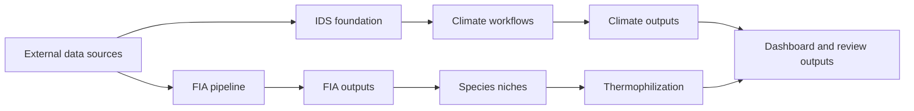

# Forest Data Compilation

**Navigation:** [Docs Hub](docs/README.md) | [Setup](scripts/SETUP.md) | [Shared Scripts](scripts/README.md) | [Reproduce](docs/REPRODUCE.md) | [Pipeline Map](docs/PIPELINE_MAP.md) | [Data Products](docs/DATA_PRODUCTS.md) | [Dashboard](docs/dashboard/)

Compiled and cleaned forest disturbance, climate, inventory, species-niche, and thermophilization datasets for analysis. The repository contains these active production paths:

- `IDS + climate`: clean USDA Forest Service Insect and Disease Survey data, then extract TerraClimate, PRISM, or WorldClim climate values at IDS locations.
- `FIA`: compile Forest Inventory and Analysis plot data into analysis-ready forest structure, disturbance, treatment, and site-climate outputs.
- `Species niches`: build BIEN range-map climate niches for FIA/P2VEG species.
- `Thermophilization`: join species niches to FIA recruitment composition and build community-weighted climate-affinity summaries.

Module-level `data/` directories keep `.gitkeep` placeholders where useful, but large raw, intermediate, and generated outputs are kept out of git.

## Start Here

If you are reviewing the repo, start with these pages:

1. [Docs Hub](docs/README.md) for the full navigation map.
2. [Reproduce](docs/REPRODUCE.md) for exact run order.
3. [Pipeline Map](docs/PIPELINE_MAP.md) for visual orientation.
4. [Data Products](docs/DATA_PRODUCTS.md) for output locations, server-aligned directories, and what is or is not tracked in git.

If you are working locally and want the easiest visual overview, run `streamlit run docs/dashboard/app.py` and start on the `Architecture` page in the sidebar.

If you want a specific workstream right away:

- [IDS overview](01_ids/README.md)
- [TerraClimate overview](02_terraclimate/README.md)
- [PRISM overview](03_prism/README.md)
- [WorldClim overview](04_worldclim/README.md)
- [FIA overview](05_fia/README.md)
- [Species niche overview](06_species_niches/README.md)
- [Thermophilization overview](07_thermophilization/README.md)

## Workstreams

| Workstream | Purpose | Start here |
|---|---|---|
| `01_ids/` | Download, inspect, clean, and spatially organize IDS damage and survey layers | [01_ids/README.md](01_ids/README.md) |
| `02_terraclimate/` | Extract monthly TerraClimate values at IDS locations using Google Earth Engine | [02_terraclimate/README.md](02_terraclimate/README.md) |
| `03_prism/` | Extract monthly PRISM climate values for CONUS IDS observations | [03_prism/README.md](03_prism/README.md) |
| `04_worldclim/` | Extract monthly WorldClim values from locally downloaded GeoTIFFs | [04_worldclim/README.md](04_worldclim/README.md) |
| `05_fia/` | Build FIA plot-level summaries, disturbance/treatment history, and site climate | [05_fia/README.md](05_fia/README.md) |
| `06_species_niches/` | Build species-level climate niche indicators from BIEN range maps and TerraClimate | [06_species_niches/README.md](06_species_niches/README.md) |
| `07_thermophilization/` | Build FIA recruitment CWM products that consume the species niche table | [07_thermophilization/README.md](07_thermophilization/README.md) |

## At a Glance

## Reproduction Paths

### IDS + climate

1. Run the [IDS foundation pipeline](01_ids/README.md).
2. Choose one or more climate datasets:
   - [TerraClimate](02_terraclimate/README.md)
   - [PRISM](03_prism/README.md)
   - [WorldClim](04_worldclim/README.md)
3. Build final summaries with the shared script [`scripts/build_climate_summaries.R`](scripts/build_climate_summaries.R).
4. Use [docs/REPRODUCE.md](docs/REPRODUCE.md) for the exact command order.

### FIA

1. Run the [FIA overview and quick-start](05_fia/README.md).
2. Use [05_fia/WORKFLOW.md](05_fia/WORKFLOW.md) for per-script technical detail.
3. Use [docs/DATA_PRODUCTS.md](docs/DATA_PRODUCTS.md) to see which outputs are tracked in git, which are local-only, and which directories are placeholders.

### Species Niches And Thermophilization

1. Build the species universe and BIEN range-map climate niches with
   [06_species_niches/README.md](06_species_niches/README.md).
2. Build FIA recruitment community-weighted means with
   [07_thermophilization/README.md](07_thermophilization/README.md).
3. Review the QA summaries in each module before modeling.

## Key Documents

| Page | What it is for |
|---|---|
| [docs/README.md](docs/README.md) | Central documentation hub and navigation page |
| [docs/REPRODUCE.md](docs/REPRODUCE.md) | Exact run order for all active production pipelines |
| [docs/PIPELINE_MAP.md](docs/PIPELINE_MAP.md) | GitHub-renderable pipeline diagrams and links |
| [docs/DATA_PRODUCTS.md](docs/DATA_PRODUCTS.md) | Output inventory, storage locations, server-aligned skeleton, and producer scripts |
| [docs/ARCHITECTURE.md](docs/ARCHITECTURE.md) | Shared climate extraction architecture |
| [docs/TESTING.md](docs/TESTING.md) | QC, validation, and coverage gaps |
| [docs/fia-explorer.html](docs/fia-explorer.html) | Static FIA visual explainer for plot design, sampling grain, and FIADB tables |
| [scripts/SETUP.md](scripts/SETUP.md) | Environment setup, dependencies, and dashboard launch |
| [scripts/README.md](scripts/README.md) | Shared root scripts, utilities, demos, and tests |
| [docs/dashboard/app.py](docs/dashboard/app.py) | Local dashboard entrypoint; start on the `Architecture` page in the sidebar |

## Shared Code

Shared helpers live under [scripts/](scripts/README.md). This includes setup,
test running, reusable utilities, optional demos, and the shared IDS climate
summary builder used by TerraClimate, PRISM, and WorldClim. The Streamlit review
app lives under [docs/dashboard/](docs/dashboard/).

## Current Output Snapshot

| Output family | Status | Notes |
|---|---|---|
| IDS cleaned layers | Complete | Produced by `01_ids/`; raw regional downloads stay under `01_ids/data/raw/` |
| TerraClimate summaries | Complete | Final per-variable parquets live under `processed/climate/terraclimate/` |
| PRISM summaries | Complete | CONUS only |
| WorldClim summaries | Complete | Local GeoTIFF-based workflow |
| FIA plot summaries | Complete | Reviewable summary parquets are tracked in git |
| FIA site climate | Complete | Input template, pixel map, and long-format climate parquet are tracked |
| Species niches | Active | BIEN range-map niche workflow with QA summaries and documented missing-data handling |
| Thermophilization | Active | FIA recruitment CWM products consume the species niche table |

## See also

- [Docs Hub](docs/README.md)
- [IDS README](01_ids/README.md)
- [FIA README](05_fia/README.md)
- [FIA Visual Explainer](docs/fia-explorer.html)
- [Species Niche README](06_species_niches/README.md)
- [Thermophilization README](07_thermophilization/README.md)
- [Pipeline Map](docs/PIPELINE_MAP.md)
