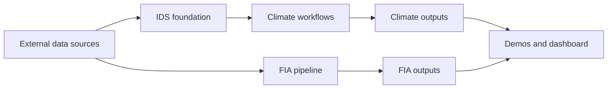

# Forest Data Compilation

**Navigation:** [Docs Hub](docs/README.md) | [Setup](scripts/SETUP.md) | [Reproduce](docs/REPRODUCE.md) | [Pipeline Map](docs/PIPELINE_MAP.md) | [Data Products](docs/DATA_PRODUCTS.md) | [Dashboard](docs/dashboard/)

Compiled and cleaned forest datasets for disturbance and climate analysis. The repository has two main workstreams:

- `IDS + climate`: clean USDA Forest Service Insect and Disease Survey data, then extract TerraClimate, PRISM, or WorldClim climate values at IDS locations.
- `FIA`: compile Forest Inventory and Analysis plot data into analysis-ready forest structure, disturbance, treatment, and site-climate outputs.

## Start Here

If you are reviewing the repo, start with these pages:

1. [Docs Hub](docs/README.md) for the full navigation map.
2. [Reproduce](docs/REPRODUCE.md) for exact run order.
3. [Pipeline Map](docs/PIPELINE_MAP.md) for visual orientation.
4. [Data Products](docs/DATA_PRODUCTS.md) for output locations and what is already tracked in git.

If you are working locally and want the easiest visual overview, run `streamlit run docs/dashboard/app.py` and start on the `Architecture` page in the sidebar.

If you want a specific workstream right away:

- [IDS overview](01_ids/README.md)
- [TerraClimate overview](02_terraclimate/README.md)
- [PRISM overview](03_prism/README.md)
- [WorldClim overview](04_worldclim/README.md)
- [FIA overview](05_fia/README.md)

## Workstreams

| Workstream | Purpose | Start here |
|---|---|---|
| `01_ids/` | Download, inspect, clean, and spatially organize IDS damage and survey layers | [01_ids/README.md](01_ids/README.md) |
| `02_terraclimate/` | Extract monthly TerraClimate values at IDS locations using Google Earth Engine | [02_terraclimate/README.md](02_terraclimate/README.md) |
| `03_prism/` | Extract monthly PRISM climate values for CONUS IDS observations | [03_prism/README.md](03_prism/README.md) |
| `04_worldclim/` | Extract monthly WorldClim values from locally downloaded GeoTIFFs | [04_worldclim/README.md](04_worldclim/README.md) |
| `05_fia/` | Build FIA plot-level summaries, disturbance/treatment history, and site climate | [05_fia/README.md](05_fia/README.md) |

## At a Glance

## Reproduction Paths

### IDS + climate

1. Run the [IDS foundation pipeline](01_ids/README.md).
2. Choose one or more climate datasets:
   - [TerraClimate](02_terraclimate/README.md)
   - [PRISM](03_prism/README.md)
   - [WorldClim](04_worldclim/README.md)
3. Build final summaries with the shared script [`scripts/build_climate_summaries.R`](scripts/build_climate_summaries.R).
4. Use [docs/REPRODUCE.md](docs/REPRODUCE.md) for the exact command order.

### FIA

1. Run the [FIA overview and quick-start](05_fia/README.md).
2. Use [05_fia/WORKFLOW.md](05_fia/WORKFLOW.md) for per-script technical detail.
3. Use [docs/DATA_PRODUCTS.md](docs/DATA_PRODUCTS.md) to see which outputs are already tracked in git.

## Key Documents

| Page | What it is for |
|---|---|
| [docs/README.md](docs/README.md) | Central documentation hub and navigation page |
| [docs/REPRODUCE.md](docs/REPRODUCE.md) | Exact run order for all production pipelines |
| [docs/PIPELINE_MAP.md](docs/PIPELINE_MAP.md) | GitHub-renderable pipeline diagrams and links |
| [docs/DATA_PRODUCTS.md](docs/DATA_PRODUCTS.md) | Output inventory, storage locations, and producer scripts |
| [docs/ARCHITECTURE.md](docs/ARCHITECTURE.md) | Shared climate extraction architecture |
| [docs/TESTING.md](docs/TESTING.md) | QC, validation, and coverage gaps |
| [scripts/SETUP.md](scripts/SETUP.md) | Environment setup, dependencies, and dashboard launch |
| [docs/dashboard/app.py](docs/dashboard/app.py) | Local dashboard entrypoint; start on the `Architecture` page in the sidebar |

## Shared Code

| Location | Role |
|---|---|
| [scripts/utils/](scripts/utils/) | Shared utility functions for config loading, time conversion, climate extraction, GEE helpers, and metadata |
| [scripts/build_climate_summaries.R](scripts/build_climate_summaries.R) | Shared climate summary builder used by TerraClimate, PRISM, and WorldClim |
| [scripts/demos/](scripts/demos/) | Demo analyses showing how to use outputs after the pipelines are run |
| [docs/dashboard/](docs/dashboard/) | Streamlit dashboard for browsing outputs, schemas, and examples |

## Current Output Snapshot

| Output family | Status | Notes |
|---|---|---|
| IDS cleaned layers | Complete | Produced by `01_ids/` |
| TerraClimate summaries | Complete | Shared summary outputs live under `processed/climate/terraclimate/` |
| PRISM summaries | Complete | CONUS only |
| WorldClim summaries | Complete | Local GeoTIFF-based workflow |
| FIA plot summaries | Complete | Main parquet outputs are tracked in git |
| FIA site climate | Complete | Git-tracked monthly site climate parquet |

## See also

- [Docs Hub](docs/README.md)
- [IDS README](01_ids/README.md)
- [FIA README](05_fia/README.md)
- [Pipeline Map](docs/PIPELINE_MAP.md)
