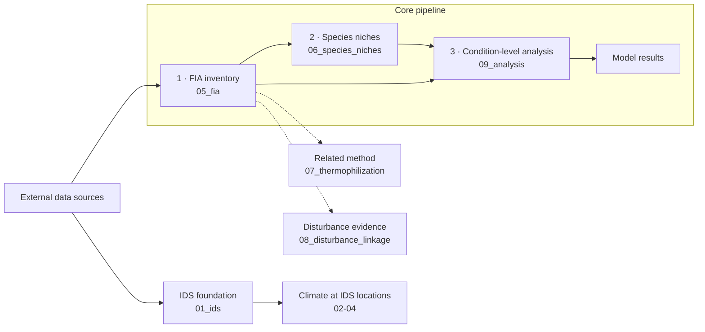

# Forest Data Compilation

**Navigation:** [Docs Hub](docs/README.md) | [Analysis](09_analysis/README.md) | [Setup](scripts/SETUP.md) | [Shared Scripts](scripts/README.md) | [Reproduce](docs/REPRODUCE.md) | [Pipeline Map](docs/PIPELINE_MAP.md) | [Find Data](docs/DATA_CATALOG.md) | [Join & Query Guide](docs/QUERY_GUIDE.md) | [Data Products](docs/DATA_PRODUCTS.md) | [Dashboard](docs/dashboard/)

Compiled and cleaned forest inventory, species-niche, disturbance, and climate data, and the condition-level analysis built from them.

## Core Pipeline: Raw Data to Model Results

The current model data and results come from three steps, run in this order:

| Step | Module | What it produces | Run |
|---|---|---|---|
| 1 | [`05_fia/`](05_fia/README.md) | FIA extracts and national summaries, the plot-visit context, and the stable-plot site list | `scripts/core/01`–`05`, then `scripts/foundations/01_build_plot_visit_context.R` and `scripts/site_climate/01_build_site_list.R` |
| 2 | [`06_species_niches/`](06_species_niches/README.md) | Eight climate indicators per species from BIEN range maps and TerraClimate | `scripts/01`–`05`; script `04` needs Google Earth Engine |
| 3 | [`09_analysis/`](09_analysis/README.md) | Stable-condition histories, climate-niche CWM change, agent-attributed cumulative mortality, cumulative site CWD, model inputs, nine preliminary models, and robustness checks | `Rscript 09_analysis/scripts/run_analysis_pipeline.R` |

- **Exact commands:** [docs/REPRODUCE.md](docs/REPRODUCE.md), Paths 3, 4, and 7.
- **Current results:** [09_analysis/results/model_runs/](09_analysis/results/model_runs/README.md), the repository's single authoritative model run.
- **Method definitions:** [09_analysis/docs/METHODS.md](09_analysis/docs/METHODS.md).
- **Data for collaborators:** `Rscript forest_explorer/export/build_research_bundle.R` builds one DuckDB file with the tables for each requested research question; see [forest_explorer/README.md](forest_explorer/README.md#research-bundle).

A distinct live+dead severity definition is still pending.

## Other Modules

These are not used by the current models. They are independent workstreams or retained resources.

| Module | Role | What it holds |
|---|---|---|
| [`01_ids/`](01_ids/README.md) | Independent workstream | Cleaned USDA Forest Service Insect and Disease Survey layers |
| [`02_terraclimate/`](02_terraclimate/README.md), [`03_prism/`](03_prism/README.md), [`04_worldclim/`](04_worldclim/README.md) | Independent workstream | Climate values extracted at IDS locations |
| [`07_thermophilization/`](07_thermophilization/README.md) | Related method | An alternative plot-visit community-climate method with consecutive and first-to-last change; its outputs are not currently built |
| [`08_disturbance_linkage/`](08_disturbance_linkage/README.md) | Resource | Prepared FIA, MTBS, and IDS disturbance evidence, kept separate by source |

Module-level `data/` directories keep `.gitkeep` placeholders where useful, but large raw, intermediate, and generated outputs are kept out of git.

## Start Here

If you are reviewing the repo, start with these pages:

1. [Searchable Data Catalog](docs/DATA_CATALOG.md) to find a product or variable, its row scale, path, and producer.
2. [Dataset Query Guide](docs/QUERY_GUIDE.md) to see compatible joins and ready-made research recipes.
3. [Docs Hub](docs/README.md) for the full navigation map.
4. [Reproduce](docs/REPRODUCE.md) for exact run order.
5. [Pipeline Map](docs/PIPELINE_MAP.md) for visual orientation.
6. [Data Products](docs/DATA_PRODUCTS.md) for storage conventions and workflow context.

If you are working locally and want the easiest visual overview, run `streamlit run docs/dashboard/app.py`. The Home page links to everything: `Analysis` shows the core pipeline and current results, and the `Data` menu holds `Find data` (search tables and variables), `Build a dataset` (joins and export queries), `FIA inputs`, and the `FIA field guide`.

## Module Layout

Module numbers are stable identifiers, not the run order; the core run order is the three steps above. Simple pipelines keep one flat numeric sequence. Modules with independent product families use named subdirectories and restart numbering inside each family. QA code always belongs under `qa/scripts/`; generated diagnostics belong under `qa/outputs/` and are not committed.

## At a Glance

```mermaid
flowchart LR
  subgraph core[Core pipeline]
    C[1 · FIA inventory<br/>05_fia] --> G[2 · Species niches<br/>06_species_niches]
    C --> H[3 · Condition-level analysis<br/>09_analysis]
    G --> H
    H --> R[Model results]
  end
  A[External data sources] --> C
  A --> B[IDS foundation<br/>01_ids]
  B --> D[Climate at IDS locations<br/>02-04]
  C -.-> T[Related method<br/>07_thermophilization]
  C -.-> L[Disturbance evidence<br/>08_disturbance_linkage]
```

Dashed arrows lead to retained modules that the current models do not use.

## Reproduction Paths

### Core analysis

Follow the three steps in [Core Pipeline](#core-pipeline-raw-data-to-model-results). [docs/REPRODUCE.md](docs/REPRODUCE.md) gives every command, and `Rscript 09_analysis/scripts/run_analysis_pipeline.R --dry-run` prints the analysis stages without running them.

### IDS + climate

1. Run the [IDS foundation pipeline](01_ids/README.md).
2. Choose one or more climate datasets:
   - [TerraClimate](02_terraclimate/README.md)
   - [PRISM](03_prism/README.md)
   - [WorldClim](04_worldclim/README.md)
3. Build final summaries with the shared script [`scripts/build_climate_summaries.R`](scripts/build_climate_summaries.R).
4. Use [docs/REPRODUCE.md](docs/REPRODUCE.md) for the exact command order.

### FIA

1. Run the [FIA overview and quick-start](05_fia/README.md).
2. Use [05_fia/WORKFLOW.md](05_fia/WORKFLOW.md) for per-script technical detail.
3. Use [docs/DATA_PRODUCTS.md](docs/DATA_PRODUCTS.md) to see which outputs are tracked in git, which are local-only, and which directories are placeholders.

### Related modules

- [07_thermophilization/README.md](07_thermophilization/README.md) builds the alternative plot-visit community-climate products from the FIA and species-niche outputs.
- [08_disturbance_linkage/README.md](08_disturbance_linkage/README.md) prepares FIA, MTBS, and IDS disturbance evidence.

## Key Documents

| Page | What it is for |
|---|---|
| [docs/README.md](docs/README.md) | Central documentation hub and navigation page |
| [docs/REPRODUCE.md](docs/REPRODUCE.md) | Exact run order for all active production pipelines |
| [docs/DATA_CATALOG.md](docs/DATA_CATALOG.md) | Searchable products, variables, paths, row scales, and producers |
| [docs/QUERY_GUIDE.md](docs/QUERY_GUIDE.md) | Curated joins, row-expansion warnings, and research query recipes |
| [docs/PIPELINE_MAP.md](docs/PIPELINE_MAP.md) | GitHub-renderable pipeline diagrams and links |
| [docs/DATA_PRODUCTS.md](docs/DATA_PRODUCTS.md) | Output inventory, storage locations, server-aligned skeleton, and producer scripts |
| [docs/ARCHITECTURE.md](docs/ARCHITECTURE.md) | Shared climate extraction architecture |
| [docs/TESTING.md](docs/TESTING.md) | QC, validation, and coverage gaps |
| [docs/fia-explorer.html](docs/fia-explorer.html) | Static FIA visual explainer for plot design, sampling grain, and FIADB tables |
| [scripts/SETUP.md](scripts/SETUP.md) | Environment setup, dependencies, and dashboard launch |
| [scripts/README.md](scripts/README.md) | Shared root scripts, utilities, demos, and tests |
| [docs/dashboard/README.md](docs/dashboard/README.md) | Local dashboard guide; the `Analysis` page shows the core pipeline and current results |

## Shared Code

Shared helpers live under [scripts/](scripts/README.md). This includes setup, test running, reusable utilities, optional demos, and the shared IDS climate summary builder used by TerraClimate, PRISM, and WorldClim. The Streamlit review app lives under [docs/dashboard/](docs/dashboard/).

## Current Output Snapshot

| Output family | Status | Notes |
|---|---|---|
| IDS cleaned layers | Complete | Produced by `01_ids/`; raw regional downloads stay under `01_ids/data/raw/` |
| TerraClimate summaries | Complete | Final per-variable parquets live under `processed/climate/terraclimate/` |
| PRISM summaries | Complete | CONUS only |
| WorldClim summaries | Complete | Local GeoTIFF-based workflow |
| FIA plot summaries | Complete | Generated locally by the FIA workflow; large Parquets are gitignored |
| FIA site climate | Partial | The FIA-wide input template is tracked, but its pixel map and climate output are not built; a separate point-climate extraction exists locally |
| Species niches | Active | BIEN range-map niche workflow with QA summaries and documented missing-data handling |
| Condition-level analysis | Preliminary | Nine preliminary models and robustness checks committed under `09_analysis/results/model_runs/` |
| Plot-visit thermophilization | Related method | Code and documentation retained in `07_thermophilization/`; outputs are not currently built |
| Disturbance evidence | Resource | Preparation code retained in `08_disturbance_linkage/`; not used by the current models |

## See also

- [Docs Hub](docs/README.md)
- [IDS README](01_ids/README.md)
- [FIA README](05_fia/README.md)
- [FIA Visual Explainer](docs/fia-explorer.html)
- [Species Niche README](06_species_niches/README.md)
- [Analysis README](09_analysis/README.md)
- [Thermophilization README](07_thermophilization/README.md) (related method)
- [Pipeline Map](docs/PIPELINE_MAP.md)
