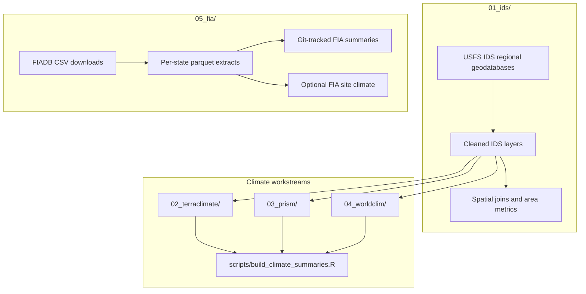

# Pipeline Map

**Navigation:** [Repo Home](../README.md) | [Docs Hub](README.md) | [Setup](../scripts/SETUP.md) | [Reproduce](REPRODUCE.md) | [Pipeline Map](PIPELINE_MAP.md) | [Data Products](DATA_PRODUCTS.md)

This page provides the Markdown-first version of the repository pipeline. If you are working locally and want the most guided visual walkthrough, run `streamlit run docs/dashboard/app.py` and open the `Architecture` page. The [HTML companion](pipeline_diagram.html) is a short static summary, not a separate full explainer.

## High-Level Flow

## Workstream Links

| Part of the pipeline | Overview | Technical details | Scripts |
|---|---|---|---|
| IDS foundation | [01_ids/README.md](../01_ids/README.md) | [01_ids/WORKFLOW.md](../01_ids/WORKFLOW.md) | [01_ids/scripts/](../01_ids/scripts/) |
| TerraClimate | [02_terraclimate/README.md](../02_terraclimate/README.md) | [02_terraclimate/WORKFLOW.md](../02_terraclimate/WORKFLOW.md) | [02_terraclimate/scripts/](../02_terraclimate/scripts/) |
| PRISM | [03_prism/README.md](../03_prism/README.md) | [03_prism/WORKFLOW.md](../03_prism/WORKFLOW.md) | [03_prism/scripts/](../03_prism/scripts/) |
| WorldClim | [04_worldclim/README.md](../04_worldclim/README.md) | [04_worldclim/WORKFLOW.md](../04_worldclim/WORKFLOW.md) | [04_worldclim/scripts/](../04_worldclim/scripts/) |
| FIA | [05_fia/README.md](../05_fia/README.md) | [05_fia/WORKFLOW.md](../05_fia/WORKFLOW.md) | [05_fia/scripts/](../05_fia/scripts/) |

## Shared Components

| Shared component | Purpose | Location |
|---|---|---|
| Setup instructions | Environment setup and local configuration | [scripts/SETUP.md](../scripts/SETUP.md) |
| Climate architecture | Shared climate data model and extraction pattern | [docs/ARCHITECTURE.md](ARCHITECTURE.md) |
| Climate summary builder | Shared step 3 for TerraClimate, PRISM, and WorldClim | [scripts/build_climate_summaries.R](../scripts/build_climate_summaries.R) |
| Utility scripts | Shared helpers for config, GEE, time conversion, and extraction | [scripts/utils/](../scripts/utils/) |
| QC and validation | Optional diagnostics and known QC gaps | [docs/TESTING.md](TESTING.md) |

## See also

- [Docs Hub](README.md)
- [Reproduce](REPRODUCE.md)
- [Data Products](DATA_PRODUCTS.md)
- [Dashboard entrypoint](dashboard/app.py)
- [HTML companion](pipeline_diagram.html)
