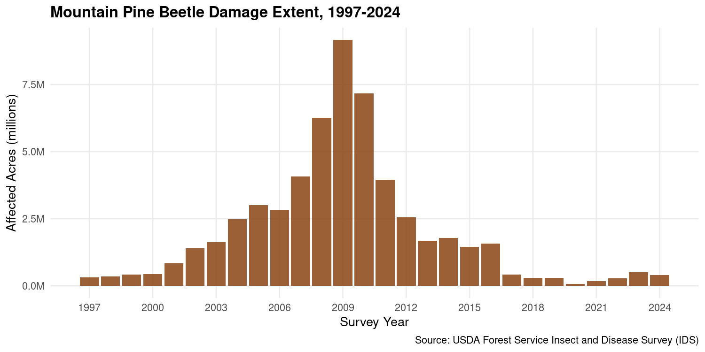
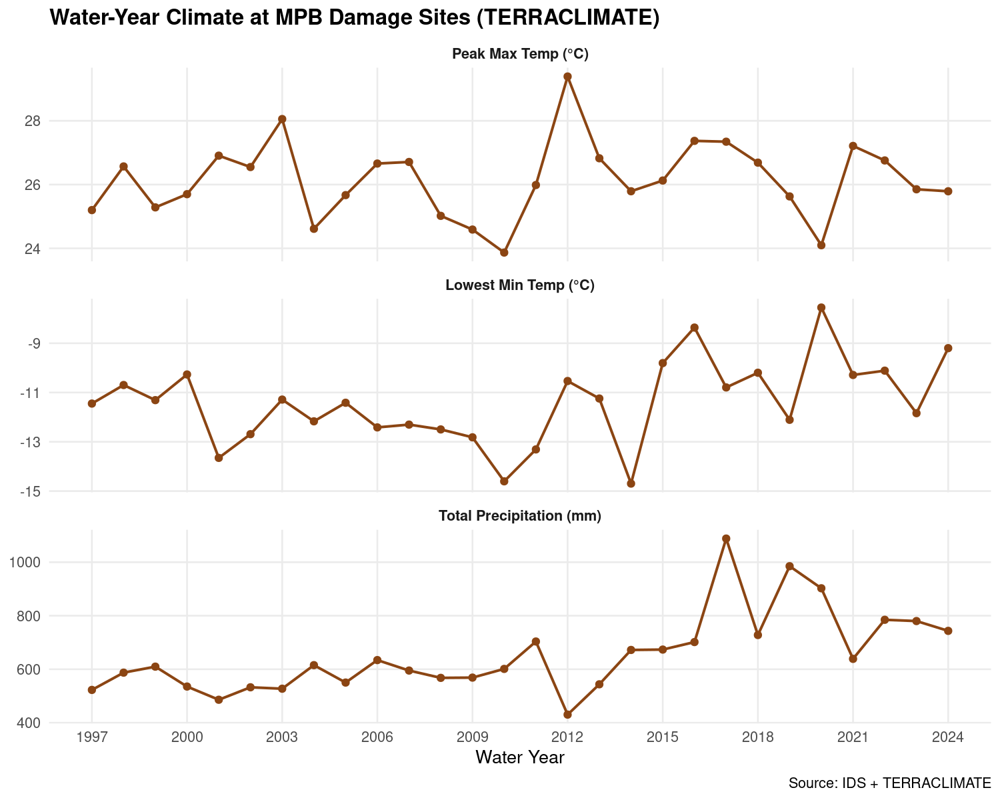
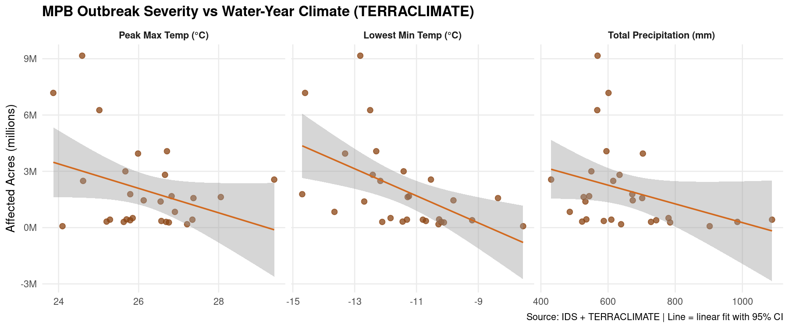
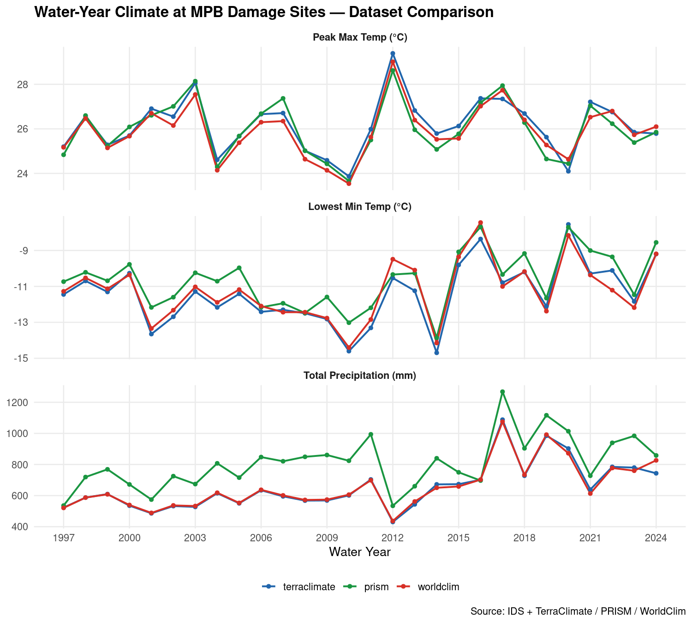
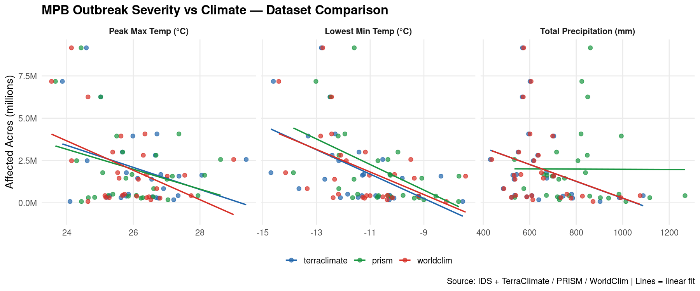

# Meeting Notes — FIA Pipeline Review
**Date:** 2026-03-03

---

## 1. Species Temperature Optima — Need Data from Joan

The pipeline has a placeholder column already built into the output parquet, waiting on a species × temperature optima table to populate it. This is the key input for the thermophilization analysis (tracking whether plots are shifting toward warmer-adapted species over time).

- Placeholder in script: [`05_fia/scripts/05_build_fia_summaries.R` line 164](05_fia/scripts/05_build_fia_summaries.R#L164)
- Output column lives in: `05_fia/data/processed/summaries/plot_tree_metrics.parquet`
- Potential sources to discuss:
  - Iverson & Prasad DISTRIB models (USFS Northern Research Station) — ~130 eastern species
  - Rehfeldt et al. climate envelopes — better coverage for western conifers
  - Derive from GBIF occurrences × WorldClim (already in pipeline)

**Ask:** Does Joan have a preferred species temperature optima dataset, or should I build one from GBIF + WorldClim?

---

## 2. FIA Methodology — Alignment with Sara Goeking's Guidance

Joan forwarded Sara's email confirming several methodology questions. I cross-checked all four points against my scripts — everything is correct.

| Topic | Code Location | Status |
|---|---|---|
| Exclude STATUSCD=0 from BA | [`config.yaml` line 288](config.yaml#L288) — `statuscd_include: [1, 2]` | ✅ |
| BA = 0.005454 × DIA² × TPA_UNADJ | [`03_extract_trees.R`](05_fia/scripts/03_extract_trees.R) | ✅ |
| Seedlings = sum(TREECOUNT) by plot | [`04_extract_seedlings_mortality.R`](05_fia/scripts/04_extract_seedlings_mortality.R) | ✅ |
| Check DSTRBCD1, DSTRBCD2, and DSTRBCD3 (all three slots) | [`05_build_fia_summaries.R` lines 629–633](05_fia/scripts/05_build_fia_summaries.R#L629) | ✅ |

**Reference:** [`email-re-FIA.pdf`](email-re-FIA.pdf)

---

## 3. Fire Codes — Decision to Flag

Sara recommended catching all disturbance codes in the 30s (`DSTRBCD >= 30 & < 40`) rather than just 30, 31, 32. I kept the narrower filter (`%in% c(30, 31, 32)`) because:

- Codes 33–39 are not in the official FIADB v9.4 spec — they appear in older special-study data only
- My data is standard FIADB downloads (1997–2024); these non-standard codes don't appear
- Including undocumented codes in an exclusion flag is hard to defend methodologically
- The full `plot_disturbance_history.parquet` preserves all raw codes for anyone doing deeper fire analysis

**Location of decision:** [`05_fia/scripts/05_build_fia_summaries.R` lines 629–633](05_fia/scripts/05_build_fia_summaries.R#L629) — `has_fire` flag

**Ask:** Does Joan agree, or does she want me to broaden the fire filter?

---

## 4. Reference Code — Stored and Cross-Checked

Joan's reference R script (disturbance and harvest checks) has been added to the repo and I cross-checked it against my pipeline. All checks are implemented.

| Reference check | Implementation |
|---|---|
| Incidental harvest flag (AGENTCD 80–89) | [`05_build_fia_summaries.R` lines 665–683](05_fia/scripts/05_build_fia_summaries.R#L665) — `exclude_harvest_agent` |
| COND_STATUS_CD = 5 (non-forest land with trees) | [`05_build_fia_summaries.R` lines 615–619](05_fia/scripts/05_build_fia_summaries.R#L615) — `exclude_nonforest` |
| TRTCD check (harvest/treatment) | [`05_build_fia_summaries.R` lines 643–651](05_fia/scripts/05_build_fia_summaries.R#L643) — `exclude_harvest` |
| DSTRBCD check (disturbance history) | [`05_build_fia_summaries.R` lines 621–640](05_fia/scripts/05_build_fia_summaries.R#L621) — `has_fire`, `has_insect` |

**Reference script stored at:** [`05_fia/reference/fia_disturbance_harvest_checks.R`](05_fia/reference/fia_disturbance_harvest_checks.R)

**Exclusion flags output:** `05_fia/data/processed/summaries/plot_exclusion_flags.parquet`

---

## 5. ITRDB Sites — Confirm Scope

`all_site_locations.csv` contains both FIA plot locations and ITRDB (International Tree Ring Data Bank) sites. I'm not sure if ITRDB sites are intentional for the current analysis scope.

- **File:** [`05_fia/data/processed/site_climate/all_site_locations.csv`](05_fia/data/processed/site_climate/all_site_locations.csv)
- FIA sites use numeric PLT_CN identifiers
- ITRDB sites use alphanumeric IDs (e.g., `YUGO006`, `ZIMB001`) and span global locations including outside the US

**Ask:** Should ITRDB sites be included in the TerraClimate extraction? If so, are the current ones the right set?

---

## 6. Demo Scripts

Three demo scripts in [`scripts/`](scripts/) show how to load and analyze the compiled datasets. They're designed to run end-to-end after the pipelines have been executed.

### Demo 01 — IDS Disturbance + Gridded Climate ([`scripts/demo_01_ids_climate.R`](scripts/demo_01_ids_climate.R))

Demonstrates the core workflow: linking IDS damage polygons to area-weighted gridded climate summaries. The example case is Mountain Pine Beetle (DCA_CODE 11006) — filtering 4.4M damage areas down to ~1.3M MPB rows via a SQL query at read time, joining to climate parquets lazily in Arrow, then aggregating to water-year summaries.

Works with TerraClimate (default), PRISM, or WorldClim:

```bash
Rscript scripts/demo_01_ids_climate.R                # TerraClimate
Rscript scripts/demo_01_ids_climate.R prism
Rscript scripts/demo_01_ids_climate.R worldclim
```

Output: `output/demo_01_ids_climate_<dataset>/` — 3 figures + `annual_summary.csv`

**Figure 1 — MPB damage extent over time**



**Figure 2 — Water-year climate at MPB damage sites**



**Figure 3 — Outbreak severity vs. water-year climate**



---

### Demo 02 — FIA Forest Inventory ([`scripts/demo_02_fia_forest.R`](scripts/demo_02_fia_forest.R))

Demonstrates how to work with the full set of compiled FIA parquets. Covers seven parts:

- **A — Plot exclusion flags:** loads `plot_exclusion_flags.parquet`, applies the standard clean filter (`pct_forested >= 0.5 & !exclude_any`), and summarizes flag rates by state
- **B — Tree metrics:** mean live basal area over time and distribution of BA-weighted species diversity (Shannon H) across clean plots
- **C — Disturbance history:** stacked bar of disturbance records by category (fire, insect, wind, human) and year, sourced from `DSTRBCD1/2/3`
- **D — Damage agents:** top agents by total basal area affected, from tree-level `plot_damage_agents.parquet`
- **E — Treatment history:** counts by treatment type (harvest, planting, site prep, etc.)
- **F — Seedling regeneration:** plot-level seedling totals from `plot_seedling_metrics.parquet`
- **G — Mortality:** natural mortality by agent code from `plot_mortality_metrics.parquet`

```bash
Rscript scripts/demo_02_fia_forest.R
```

Output: `output/demo_02_fia_forest/` — figures + CSVs *(run FIA pipeline first)*

---

### Demo 03 — Point-Based TerraClimate at FIA Sites ([`scripts/demo_03_site_climate.R`](scripts/demo_03_site_climate.R))

Demonstrates how to query `fia_site_climate.parquet` — monthly TerraClimate (1958–present) for 6,956 FIA plot locations. Also shows how to add custom lat/lon sites to the extraction.

- **A — Site list:** inspect `all_site_locations.csv` (the input defining which locations were extracted)
- **B — Parquet structure:** 23.5M rows × 6 variables (tmmx, tmmn, pr, def, pet, aet)
- **C — Annual water-year summaries:** per-site aggregates (precip = sum, temps = mean)
- **D — Long-term climatology:** 1981–2010 baseline means per site
- **E — Figures:** CWD trend (1958–present), summer Tmax trend, and long-term CWD vs. precip climate space
- **F — Geographic subset:** example filtering to Colorado sites
- **G — Adding custom sites:** how to append new lat/lon rows and re-run the GEE extraction

```bash
Rscript scripts/demo_03_site_climate.R
```

Output: `output/demo_03_site_climate/` — figures + CSVs *(run `06_extract_site_climate.R` first)*

---

### Cross-Dataset Comparison ([`scripts/compare_mpb_climate_datasets.R`](scripts/compare_mpb_climate_datasets.R))

Plots TerraClimate, PRISM, and WorldClim results on the same axes for direct comparison. Run all three `demo_01` variants first.

```bash
Rscript scripts/demo_01_ids_climate.R terraclimate
Rscript scripts/demo_01_ids_climate.R prism
Rscript scripts/demo_01_ids_climate.R worldclim
Rscript scripts/compare_mpb_climate_datasets.R
```

Output: `output/demo_mpb_comparison/` — 2 figures

**Figure 1 — Climate time series, all three datasets on the same axes**



**Figure 2 — Outbreak severity vs. climate, all three datasets**



---

## 7. Dashboard Demo

Unified Streamlit dashboard is ready — shows pipeline status, data schemas, and load code for all datasets.

```bash
streamlit run docs/dashboard/app.py
```

Relevant pages:
- **Page 1 — IDS Survey:** damage area overview, DCA/host code lookups, coverage map
- **Page 2 — Climate:** TerraClimate, PRISM, WorldClim variable catalogs and file inventory
- **Page 3 — FIA Forest:** tree metrics, disturbance history, damage agents, exclusion flags
- **Page 5 — Data Catalog:** all output parquets with schemas and R/Python load code

**Full pipeline documentation:** [`README.md`](README.md) · [`05_fia/WORKFLOW.md`](05_fia/WORKFLOW.md)
